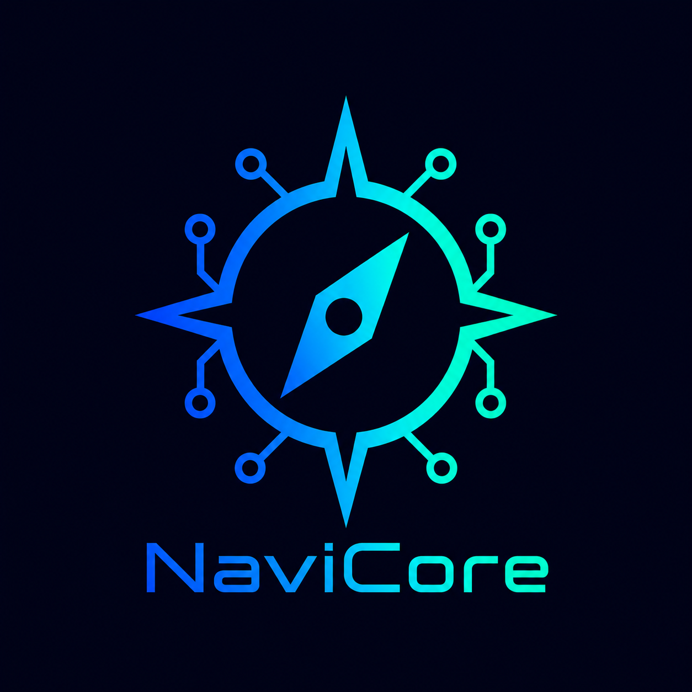
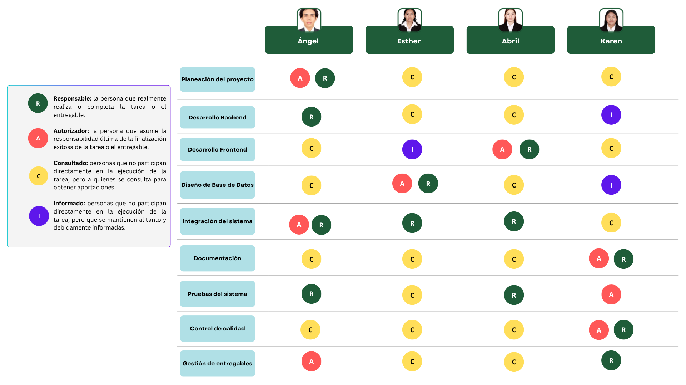
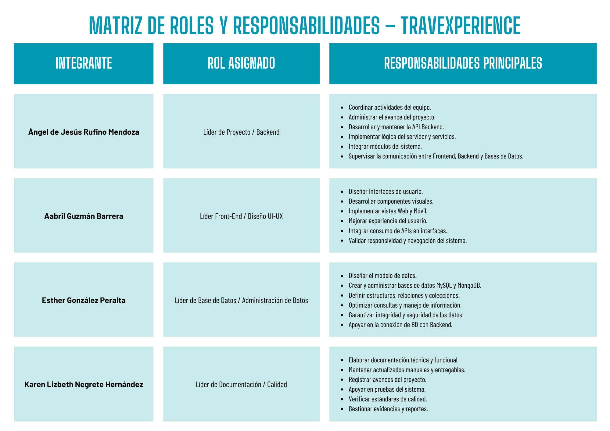
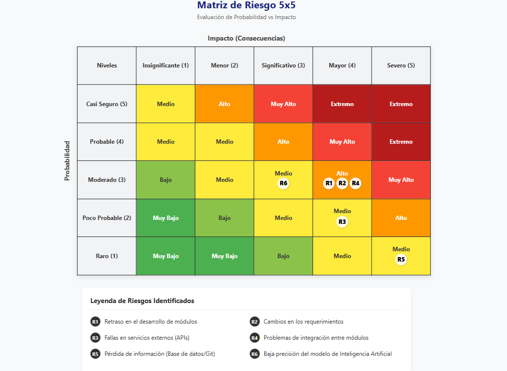

<p align="center">
  
  &nbsp;&nbsp;&nbsp;&nbsp;&nbsp;&nbsp;
  
</p>

<h1 align="center">TraveXperience</h1>

<p align="center">
Plataforma Inteligente para la Planificación de Viajes y Experiencias Locales
</p>

---

## Tabla de Contenido

- [Inicio del Proyecto](#inicio-del-proyecto)
- [Gestión de Alcance](#gestión-de-alcance)
- [Tecnologías Utilizadas](#tecnologías-utilizadas)
- [Descripción del Proyecto](#descripción-del-proyecto)
- [Documentación](#documentación)
- [Estructura del Proyecto](#estructura-del-proyecto)
- [Gestión de Recursos Humanos](#gestión-de-recursos-humanos-rh)
- [Gestión de Interesados](#gestión-de-interesados-stakeholders)
- [Gestión del Tiempo](#gestión-del-tiempo-cronograma)
- [Gestión de Costos](#gestión-de-costos)
- [Gestión de Adquisiciones](#gestión-de-adquisiciones)
- [Gestión de la Comunicación](#gestión-de-la-comunicación)
- [Gestión de la Calidad](#gestión-de-la-calidad-y-buenas-prácticas)
- [Gestión de Riesgos](#gestión-de-riesgos)
- [Plan de Pruebas](#plan-de-pruebas)
- [Información del Cierre del Proyecto](#información-del-cierre-del-proyecto)

---

# Inicio del Proyecto

Este repositorio reúne la documentación, el código fuente y los modelos de datos que conforman el ecosistema **TraveXperience**.

El proyecto surge con el propósito de resolver la fragmentación de la información turística mediante una plataforma integral capaz de centralizar la planificación de viajes, la administración de presupuestos y la recomendación inteligente de destinos y actividades, ofreciendo una experiencia unificada en aplicaciones Web, Móvil y Smartwatch.

---

# Gestión de Alcance

## Objetivo General

Desarrollar una plataforma digital que permita a los usuarios planificar y descubrir viajes de forma personalizada e inteligente, integrando herramientas de búsqueda, geolocalización y un motor de recomendación basado en Machine Learning dentro de un ecosistema multidispositivo.

### Objetivos Específicos

- Diseñar una arquitectura de software robusta utilizando bases de datos híbridas (MySQL y MongoDB).
- Implementar módulos de autenticación, registro y perfiles de usuario para alimentar los modelos de Machine Learning.
- Desarrollar el módulo **"Cerca de Mí"**, orientado al turismo y entretenimiento local.
- Desarrollar el módulo **"Fuera de Casa"**, enfocado en la planificación de viajes nacionales e internacionales.
- Integrar una aplicación para Smartwatch desarrollada en Kotlin que permita consultar itinerarios en tiempo real.
- Implementar modelos de Inteligencia Artificial mediante TensorFlow.js para recomendaciones, análisis de presupuestos y validación de reseñas.

---

# Tecnologías Utilizadas

<p align="center">

* 
* 

* 

</p>

<p align="center">

* 

* 

</p>

<p align="center">

* 
* 

</p>
<p align="center">

* 

* 

* 

* 

</p>

---

# Descripción del Proyecto

**TraveXperience** integra tecnologías web, móviles y modelos de Inteligencia Artificial para brindar una experiencia turística personalizada.

Las principales funcionalidades del sistema son:

| Funcionalidad | Descripción |
|--------------|-------------|
| Descubrimiento Local | Localización de eventos y lugares cercanos mediante GPS. |
| Planificación de Viajes | Creación y administración de itinerarios completos. |
| Recomendaciones Inteligentes | Sugerencias personalizadas mediante modelos de IA. |
| Gestión de Presupuestos | Comparación de costos y estimación de gastos de viaje. |
| Sistema de Reseñas | Validación de opiniones y recomendaciones de usuarios. |
| Ecosistema Multiplataforma | Acceso desde Web, Aplicación Móvil y Smartwatch. |

---

# Documentación

Toda la documentación oficial del proyecto se encuentra organizada en la nube para facilitar su consulta y actualización.

| Documento | Enlace |
|------------|---------|
| Acta de Inicio del Proyecto| [Acta Inicio](https://docs.google.com/document/d/16_z9WfvqtbjjSKTI0kx8ubD_eVxhxp5C/edit?usp=sharing&ouid=106142142983528326169&rtpof=true&sd=true)|
| Documento de Requerimientos Funcionales | [RF](https://docs.google.com/document/d/1uPKkbRELlQZyM3R7ph1ygHaBQfVo5SBS/edit?usp=sharing&ouid=106142142983528326169&rtpof=true&sd=true) |
| Documento de Requerimientos No Funcionales  | [RNF](https://docs.google.com/document/d/1-R3D4sHswrpXpU1gkiQw6Fo9ZMjvmysR/edit?usp=sharing&ouid=106142142983528326169&rtpof=true&sd=true) |
| Bitacora |[Bitacora](https://docs.google.com/document/d/1lWPqyHjlPCMqC1OkHWAnwC_Et9cTdbsv/edit?usp=sharing&ouid=106142142983528326169&rtpof=true&sd=true) |
| Informe de Avance | [Informe](https://docs.google.com/document/d/1lWPqyHjlPCMqC1OkHWAnwC_Et9cTdbsv/edit?usp=sharing&ouid=106142142983528326169&rtpof=true&sd=true) |
| Acuerdos de Comunicación del Proyecto| [Acuerdos](https://docs.google.com/document/d/1HiWvkllrFyUQLuqHqkTnWENDlYkNoBFS/edit?usp=sharing&ouid=106142142983528326169&rtpof=true&sd=true) |
| Minuta | [Minuta](https://docs.google.com/document/d/1rLzDgaxX1NFwCuAeGY2T8-blOClBV5sP/edit?usp=sharing&ouid=106142142983528326169&rtpof=true&sd=true)|
| Plan de Pruebas | [Plan de Pruebas](https://docs.google.com/document/d/1NWitr0lyHtEWb6S4q6MOjf2UZl38IipO/edit?usp=sharing&ouid=106142142983528326169&rtpof=true&sd=true) |
| Control de Cambios | [Control de Cambios](https://docs.google.com/document/d/1hcdH6Ma6WtBED87mdF6k35e4y85KsZCe/edit?usp=sharing&ouid=106142142983528326169&rtpof=true&sd=true) |
| Documento de Reglas de Negocio (BR) | [BR](https://docs.google.com/document/d/1s9fk1gCRu_dE1HFDjWW800ylvd0n4PQp/edit?usp=sharing&ouid=106142142983528326169&rtpof=true&sd=true) |
| Casos de Uso | [Casos de Uso](https://docs.google.com/document/d/1N8pGBkkbKoxazM9j5Od8pUSq1WCVEdVh/edit?usp=sharing&ouid=106142142983528326169&rtpof=true&sd=true) |
| Diagramas UML | [Diagramas UML](https://docs.google.com/document/d/1e2Vr-3G3BnmKDv26ZD3ZOXDAwSqhxTeF/edit?usp=sharing&ouid=106142142983528326169&rtpof=true&sd=true) |
| Manual de Usuario | LINK |
| Manual Técnico | LINK |
| Manual de Despliegue | LINK |


---

# Estructura del Proyecto

```text
Proyecto/
│
├── README.md
│
├── DataBases/
│   ├── SQL/
│   └── NoSQL/
│
├── DataModels/
│   ├── Supervised_LMs/
│   └── Unsupervised_LMs/
│
├── Deliverables/
│   ├── API/
│   ├── WearableApp/
│   └── WebApp/
│
├── Docs/
│
├── images/
│
└── .git/
```
---

# Gestión de Recursos Humanos (RH)

El equipo de desarrollo está conformado por integrantes con responsabilidades específicas para garantizar el cumplimiento de los objetivos del proyecto.

| Integrante | GitHub | Rol |
|------------|--------|-----|
| Ángel de Jesús Rufino Mendoza | https://github.com/RufinoAngel | Líder del Proyecto · Desarrollo Backend · Integración del Sistema |
| Abril Guzmán Barrera | https://github.com/Abrilgb | Líder Front-End · Diseño e Implementación de Interfaces |
| Karen Lizbeth Negrete Hernández | https://github.com/KarenNegrete06 | Líder de Documentación · Gestión Documental |
| Esther Gonzales Peralta | https://github.com/Esther-Gonzalez04 | Líder de Base de Datos · Modelado y Administración de Datos |




---

# Gestión de Interesados (Stakeholders)

Los interesados representan las personas y organizaciones involucradas directa o indirectamente en el desarrollo del proyecto.

| Stakeholder | Participación |
|--------------|--------------|
| Universidad Tecnológica de Xicotepec de Juárez (UTXJ) | Institución patrocinadora del proyecto. |
| Asesores Académicos | Supervisión, evaluación y asesoría técnica durante el desarrollo. |
| Equipo NaviCore | Planeación, desarrollo, pruebas y mantenimiento de la plataforma. |
| Usuarios Finales | Personas interesadas en planificar viajes y descubrir experiencias turísticas mediante la plataforma. |

---

# Gestión del Tiempo (Cronograma)

La administración del tiempo se realiza mediante metodologías ágiles para asegurar el cumplimiento de cada fase del proyecto.

Las actividades principales incluyen:

| Actividad | Estado |
|-----------|--------|
| Planeación del Proyecto | En desarrollo |
| Levantamiento de Requerimientos | En desarrollo |
| Diseño de Arquitectura | Pendiente |
| Desarrollo Backend | Pendiente |
| Desarrollo Frontend | Pendiente |
| Desarrollo Mobile | Pendiente |
| Integración de Machine Learning | Pendiente |
| Pruebas | Pendiente |
| Despliegue | Pendiente |

## Herramientas de Seguimiento

| Herramienta | Enlace |
|-------------|---------|
| Trello (Cronograma)| [Trello](https://trello.com/b/w96WOUoh/travexperience) |


# Gestión de Costos

El presupuesto del proyecto contempla los recursos humanos, tecnológicos y de infraestructura necesarios para su desarrollo.

## Recursos Considerados

| Recurso | Descripción |
|----------|-------------|
| Desarrollo de Software | Horas invertidas por el equipo de desarrollo. |
| Infraestructura | Servidores, almacenamiento y bases de datos. |
| Bases de Datos | MongoDB Atlas y MySQL. |
| APIs Externas | Servicios de mapas, geolocalización y recomendaciones. |
| Herramientas de Desarrollo | IDEs, control de versiones y herramientas colaborativas. |
| Diseño UI/UX | Recursos gráficos, tipografías e iconografía. |

---

# Gestión de Adquisiciones

Para el correcto funcionamiento del sistema se consideran los siguientes recursos externos.

| Recurso | Finalidad |
|----------|-----------|
| Cloud Hosting | Hospedaje de aplicaciones y servicios. |
| Dominio Web | Publicación del sistema en Internet. |
| Servicios de Base de Datos | Almacenamiento y disponibilidad de la información. |
| APIs de Mapas | Servicios de geolocalización y rutas. |
| Activos Digitales | Tipografías, iconos e imágenes utilizadas en la plataforma. |

---

# Gestión de la Comunicación

La comunicación del proyecto se establece mediante herramientas colaborativas que permiten mantener informado a todo el equipo de desarrollo.

| Medio | Propósito |
|--------|-----------|
| Google Meet | Reuniones de seguimiento, revisiones de Sprint y asesorías. |
| Microsoft Teams | Reuniones de trabajo colaborativo. |
| WhatsApp | Comunicación inmediata entre los integrantes. |
| Discord | Coordinación técnica y seguimiento de actividades. |
| GitHub | Administración del código fuente y control de versiones. |
| Trello | Gestión de tareas, cronograma y seguimiento del proyecto. |

## Estrategia de Comunicación

- Reuniones periódicas para seguimiento del avance del proyecto.
- Registro de acuerdos y actividades asignadas.
- Comunicación continua mediante plataformas digitales.
- Control de versiones centralizado mediante GitHub.
- Seguimiento de tareas utilizando metodología ágil con tablero Kanban.

---

# Gestión de la Calidad y Buenas Prácticas

La calidad del proyecto se garantiza mediante la adopción de estándares de desarrollo, control de versiones, documentación y validación continua de los componentes del sistema.

## Estándares de Calidad

| Área | Estrategia |
|------|------------|
| Código Limpio | Uso de ESLint y Prettier para mantener un código legible, consistente y estandarizado. |
| Control de Versiones | Implementación de la estrategia **Git Flow** utilizando ramas **main**, **develop** y **feature/**. |
| Documentación | Todos los módulos, APIs y componentes deberán contar con documentación actualizada. |
| Revisión de Código | Cada funcionalidad deberá ser revisada antes de integrarse a la rama principal. |
| Machine Learning | Los modelos desarrollados en TensorFlow.js deberán cumplir con métricas de precisión establecidas antes de ser desplegados. |
| Base de Datos | Validación de integridad, consistencia y respaldo periódico de la información almacenada. |

---

# Gestión de Riesgos

La identificación y administración de riesgos permite reducir el impacto de posibles incidentes durante el desarrollo del proyecto.

## Matriz de Riesgos


| Riesgo | Probabilidad | Impacto | Estrategia de Mitigación |
|--------|--------------|----------|--------------------------|
| Retraso en el desarrollo de módulos | Media | Alta | Seguimiento continuo mediante metodología ágil y revisiones semanales. |
| Cambios en los requerimientos | Media | Alta | Validación constante con asesores y actualización de la documentación. |
| Fallas en servicios externos (APIs) | Baja | Alta | Implementar alternativas y mecanismos de respaldo. |
| Problemas de integración entre módulos | Media | Alta | Realizar pruebas de integración durante cada Sprint. |
| Pérdida de información | Baja | Muy Alta | Respaldos periódicos de bases de datos y repositorios Git. |
| Baja precisión del modelo de IA | Media | Media | Entrenamiento continuo y validación con nuevos conjuntos de datos. |

---

# Plan de Pruebas

Con el propósito de garantizar la estabilidad, confiabilidad y calidad del sistema, se llevarán a cabo diferentes niveles de pruebas durante todo el ciclo de desarrollo.

## Estrategia de Pruebas

| Tipo de Prueba | Objetivo |
|----------------|----------|
| Pruebas Unitarias | Verificar el correcto funcionamiento de cada componente de forma independiente. |
| Pruebas de Integración | Validar la comunicación entre la aplicación móvil, el backend, el smartwatch y las bases de datos. |
| Pruebas Funcionales | Confirmar que los requisitos funcionales sean cumplidos correctamente. |
| Pruebas de Rendimiento | Evaluar el comportamiento del sistema bajo diferentes niveles de carga. |
| Pruebas de Estrés | Determinar el límite operativo del sistema y su recuperación ante sobrecarga. |
| User Acceptance Testing (UAT) | Validar la experiencia del usuario mediante pruebas con usuarios finales. |

## Componentes a Evaluar

- API REST desarrollada en Node.js.
- Aplicación Web y Móvil desarrollada con React Native.
- Aplicación Wearable desarrollada en Kotlin.
- Modelos de Inteligencia Artificial desarrollados con TensorFlow.js.
- Bases de datos MySQL y MongoDB.
- Integración entre todos los módulos del ecosistema.

---

# Información del Cierre del Proyecto

El proyecto será considerado concluido una vez que se cumplan los criterios establecidos por el equipo de desarrollo y los interesados.

## Criterios de Aceptación

- Finalización de todos los módulos funcionales.
- Validación y aprobación por parte de los asesores académicos.
- Entrega de la documentación técnica y funcional.
- Implementación satisfactoria en el entorno de producción.
- Validación de los modelos de Machine Learning.
- Integración completa entre las aplicaciones Web, Móvil y Smartwatch.
- Entrega del Manual Técnico, Manual de Usuario y Manual de Despliegue.
- Firma del acta de cierre del proyecto y transferencia del conocimiento al equipo responsable.

---

# Organización del Repositorio

| Directorio | Descripción |
|------------|-------------|
| `DataBases/` | Scripts, modelos y documentación de bases de datos SQL y NoSQL. |
| `DataModels/` | Modelos de Machine Learning supervisados y no supervisados. |
| `Deliverables/` | Código fuente de la API, aplicación móvil y aplicación Wearable. |
| `Docs/` | Documentación técnica, funcional y administrativa del proyecto. |
| `images/` | Recursos gráficos utilizados en la documentación. |

---

# Estado del Proyecto

| Estado | Valor |
|---------|-------|
| Desarrollo | En progreso |
| Versión | 1.0.0 |
| Licencia | Uso Académico |
| Metodología | Scrum |
| Control de Versiones | Git y GitHub |

---

<div align="center">

### TraveXperience

Plataforma Inteligente para la Planificación de Viajes y Experiencias Locales.

**Desarrollado por NaviCore**

Universidad Tecnológica de Xicotepec de Juárez

2026

</div>
